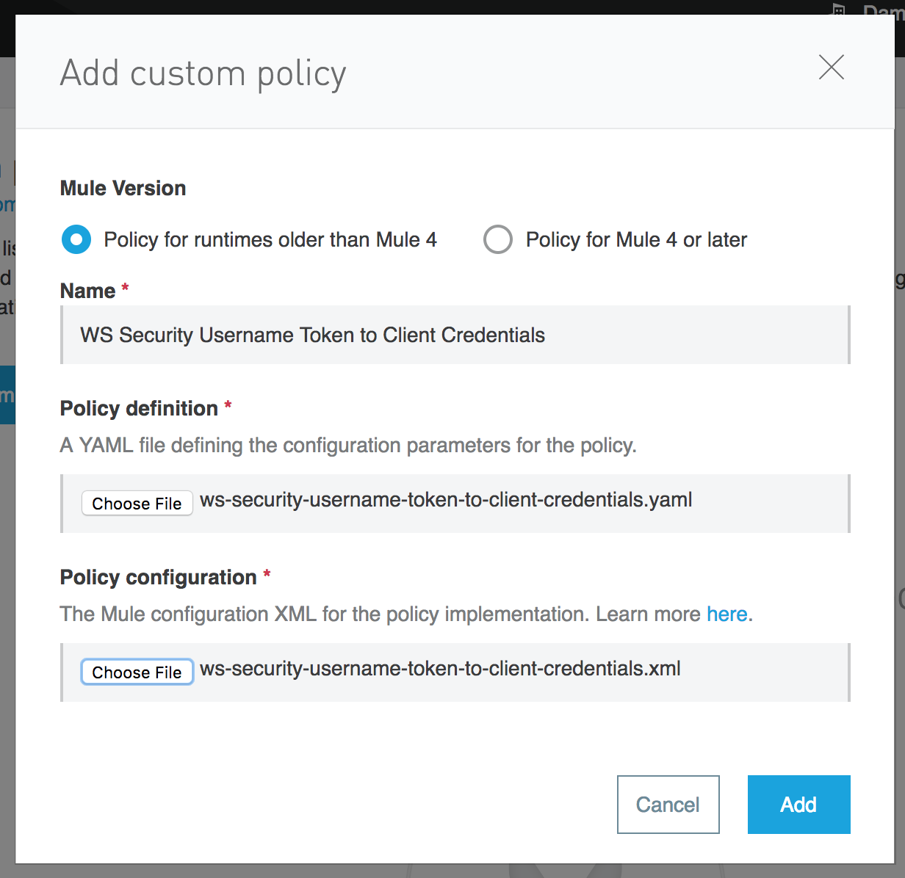
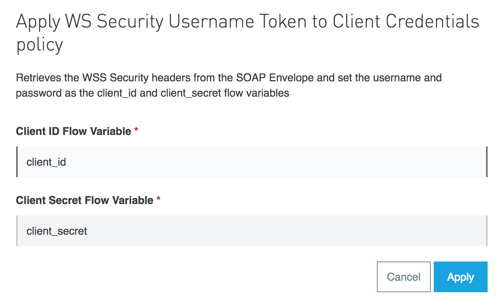
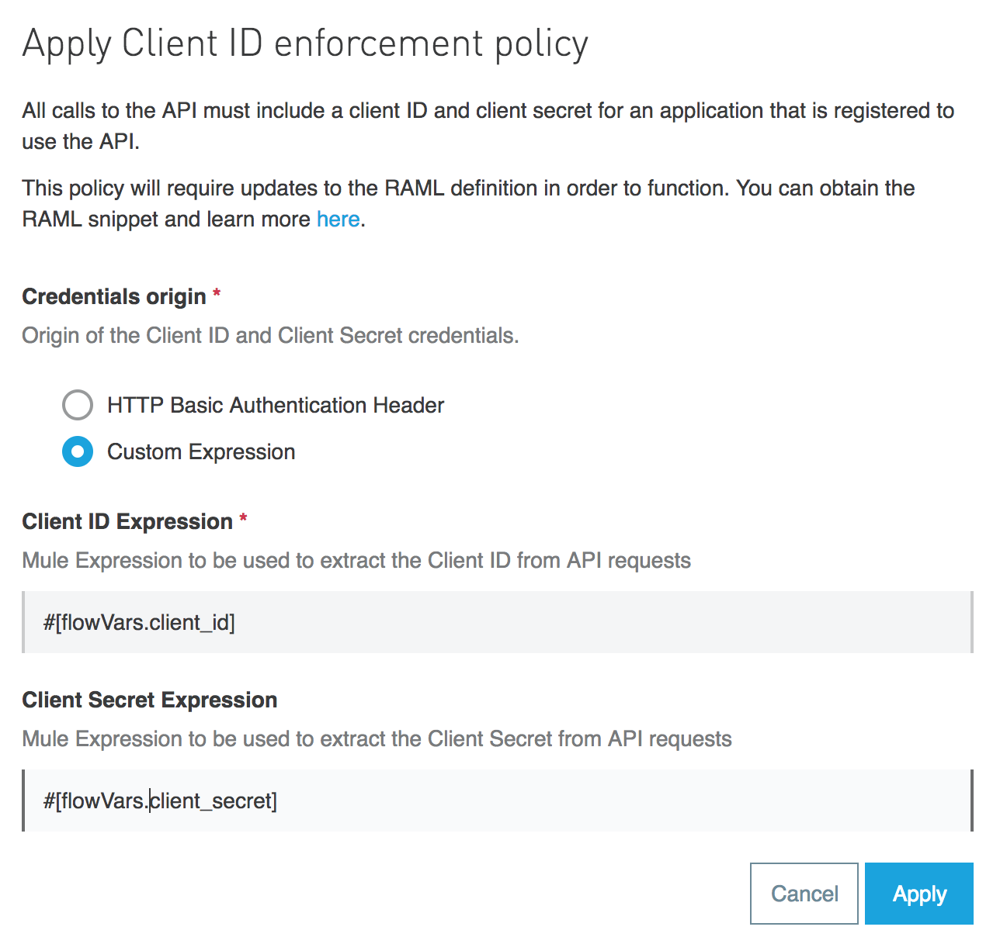
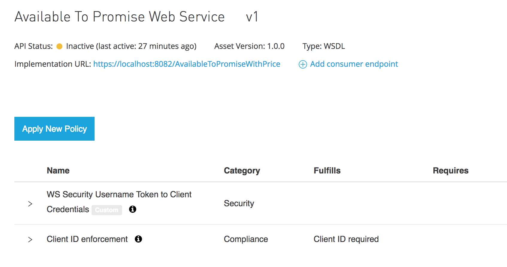
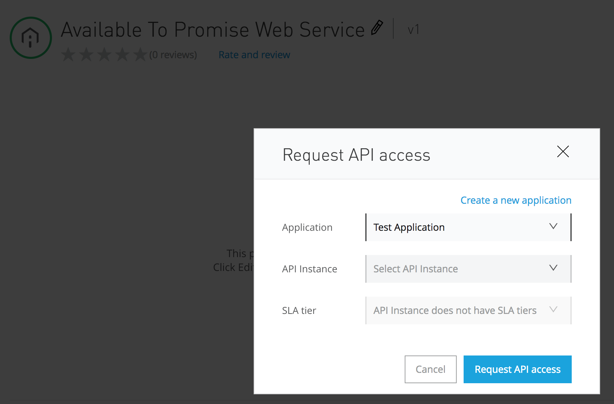
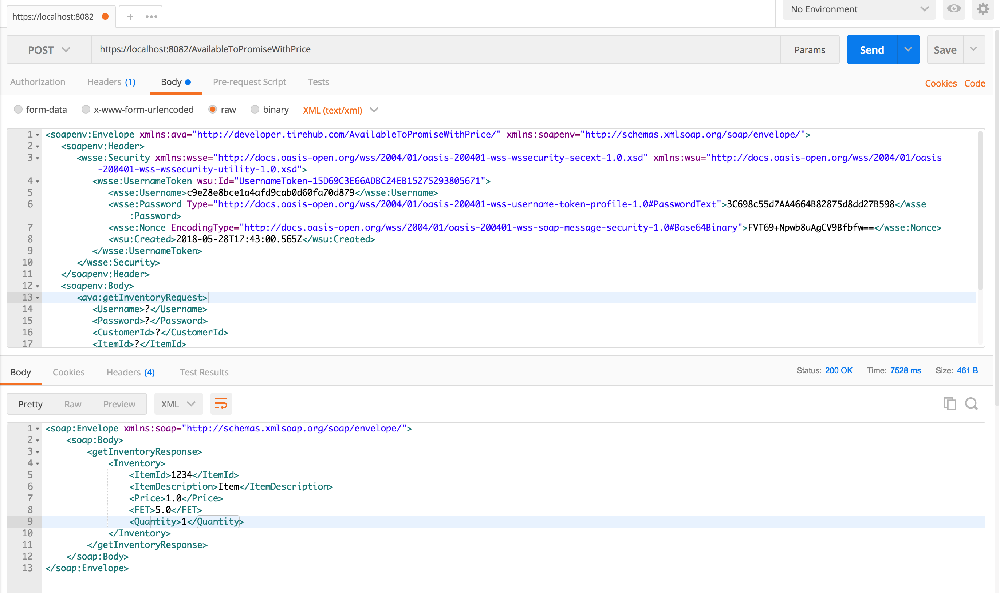

# WS Security UsernameToken to Client Credentials

## Description

This policy parses the WS Security SOAP Headers with Username and Password in plain text. It obtains these fields and stores them in flow variables.

It should to be used together with the Client ID Enforcement policy. Applying both of them, the users will be able to authenticate with their Client Application credentials following the WSS specification.

## Reference
The WS Security UsernameToken specification is based on Oasis standard. The complete specification can be found here:
https://www.oasis-open.org/committees/download.php/13392/wss-v1.1-spec-pr-UsernameTokenProfile-01.htm

These are the schemas being applied:
- S11: http://schemas.xmlsoap.org/soap/envelope/
- S12: http://www.w3.org/2003/05/soap-envelope
- wsse: http://docs.oasis-open.org/wss/2004/01/oasis-200401-wss-wssecurity-secext-1.0.xsd
- wsu: http://docs.oasis-open.org/wss/2004/01/oasis-200401-wss-wssecurity-utility-1.0.xsd

The type of password accepted by this policy is **#PasswordText**

## Guide

#### 01 - Create the custom policy

First, we have to create the Custom policy in API Manager with the proper name



#### 02 - Apply the policy on the API

Once a SOAP Web Service is defined in API Manager, we can apply the policy on it. We have to define the name of the flow variables that will contain the Client ID and Client Secret.



#### 03 - Apply Client ID Enforcement

The Client ID Enforcement policy is required as it will check the flow variables set by the previous policy against the Anypoint Platform Client Management.

When applying the policy, we have to define the Client ID and Client Secret to be obtained from the same variable that has been set by the WS Security policy.



It's important to ensure that the policies are being applied in the correct order.



#### 04 - Request API Access

We have to request access to the SOAP Web Service from Exchange to obtain the Client Credentials we'll use to consume the service.



#### 05 - Consume Web Service

Now we can send the SOAP request with the proper WS Security Headers. Notice that the Cliend ID and Client Secret is being sent in the SOAP Envelope.



This is an example of the SOAP Request body

```xml
<soapenv:Envelope xmlns:ava="http://developer.tirehub.com/AvailableToPromiseWithPrice/" xmlns:soapenv="http://schemas.xmlsoap.org/soap/envelope/">
   <soapenv:Header>
      <wsse:Security xmlns:wsse="http://docs.oasis-open.org/wss/2004/01/oasis-200401-wss-wssecurity-secext-1.0.xsd" xmlns:wsu="http://docs.oasis-open.org/wss/2004/01/oasis-200401-wss-wssecurity-utility-1.0.xsd">
         <wsse:UsernameToken wsu:Id="UsernameToken-15D69C3E66ADBC24EB15275293805671">
            <wsse:Username>c9e28e8bce1a4afd9cab0d60fa70d879</wsse:Username>
            <wsse:Password Type="http://docs.oasis-open.org/wss/2004/01/oasis-200401-wss-username-token-profile-1.0#PasswordText">3C698c55d7AA4664B82875d8dd27B598</wsse:Password>
            <wsse:Nonce EncodingType="http://docs.oasis-open.org/wss/2004/01/oasis-200401-wss-soap-message-security-1.0#Base64Binary">FVT69+Npwb8uAgCV9Bfbfw==</wsse:Nonce>
            <wsu:Created>2018-05-28T17:43:00.565Z</wsu:Created>
         </wsse:UsernameToken>
      </wsse:Security>
   </soapenv:Header>
   <soapenv:Body>
      <ava:getInventoryRequest>
         <Username>?</Username>
         <Password>?</Password>
         <CustomerId>?</CustomerId>
         <ItemId>?</ItemId>
         <Quantity>?</Quantity>
         <LocationId>?</LocationId>
         <Brand>?</Brand>
      </ava:getInventoryRequest>
   </soapenv:Body>
</soapenv:Envelope>
```
